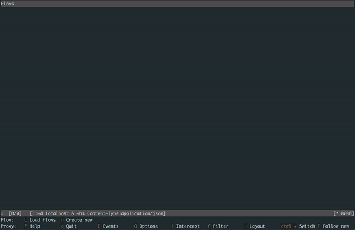
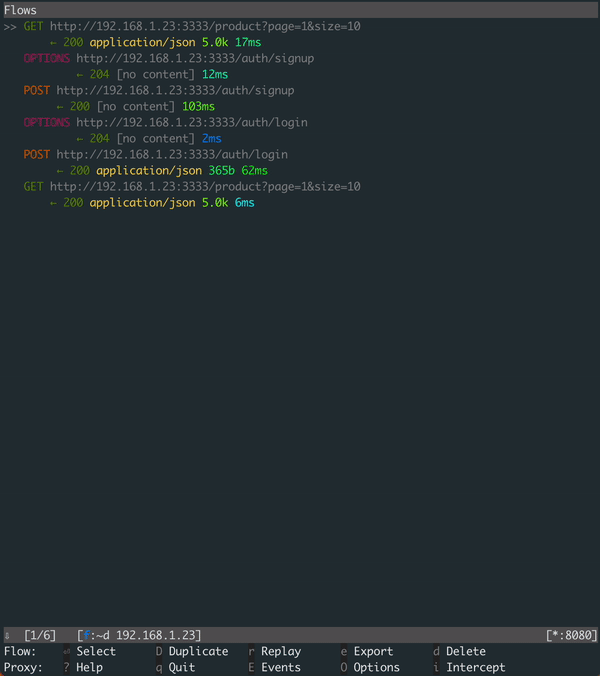
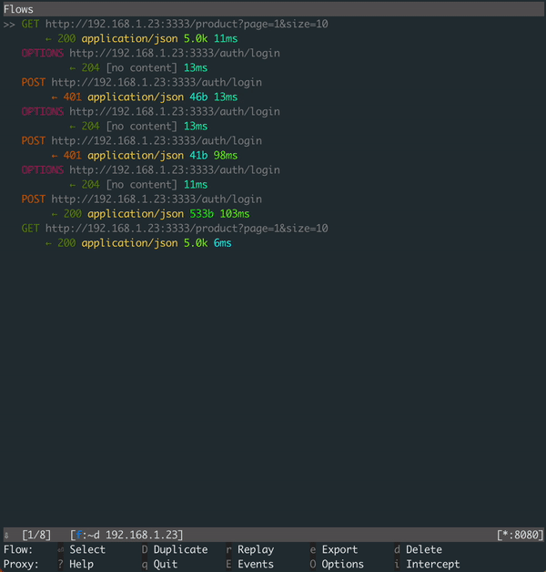

# DELIVER Attacks

A collection of attack examples that illustrate how the vulnerabilities in the DELIVER API and WEB application can be exploited. 

The DELIVER project includes following assets, each available in its
own GitHub repository:

- [DELIVER API](https://github.com/jiridj/deliver-api): An e-Commerce store backend as an API implemented with Express and MongoDB.
- [DELIVER WEB](https://github.com/jiridj/deliver-web): A simple e-Commerce web application implemented as a VueJS-based single-page app.
- [DELIVER ATTACKS](https://github.com/jiridj/deliver-attacks): Script examples of how an attacker could exploit the API's vulnerabilities.

## Installation

To run the demo scripts, you will need to install the [DELIVER API](https://github.com/jiridj/deliver-api) or [DELIVER WEB](https://github.com/jiridj/deliver-web) applications. We recommend you use [DELIVER WEB](https://github.com/jiridj/deliver-web) as it includes the API layer as well.

To install the demo tools from this repository, clone it to your local machine and install its dependencies.

```bash
npm install
```

Then install the deliver cli tool which makes it easier to run certain attack scenarios.

```bash
npm install -g
```

Now you can run any of the tools used in the attack scenarios yourself. You can verify the installation of the cli tool with the following command. It will print out the version of the tool that was installed. 

```bash
deliver version
______ _____ _     _____ _   _ ___________
|  _  \  ___| |   |_   _| | | |  ___| ___ \
| | | | |__ | |     | | | | | | |__ | |_/ /
| | | |  __|| |     | | | | | |  __||    /
| |/ /| |___| |_____| |_\ \_/ / |___| |\ \
|___/ \____/\_____/\___/ \___/\____/\_| \_|


DELIVER ATTACKS 0.1.0
```

The demo scenario not only uses the DELIVER CLI, but also showcases a few open source tools that are commonly used for penetration testing and hacking. Please refer to their respective websites for installation instructions:

- Man-in-the-Middle Proxy ([mitmproxy.org](https://mitmproxy.org))
- Hashcat ([hashcat.net](https://hashcat.net/))
- Jwt_Tool ([ticarpi/jwt_tool](https://github.com/ticarpi/jwt_tool))
- FoxyProxy ([FoxyProxy Standard](https://addons.mozilla.org/en-US/firefox/addon/foxyproxy-standard/)) with FireFox

## Demo Scenario

The DELIVER API provides the backend for an e-Commerce shop. The API comes pre-loaded with 20 products, 1000 users and over 3000 orders. Via the API you can create and manage a user account, query products, query and create orders. The API also provides administrator users the ability to manage user accounts. The API's secured endpoints require a JWT token to authenticate and authorize (in the case of administrator endpoints).

The application has over 1000 users pre-loaded. You can create extra user accounts via the signup flow in the DELIVER application. Or you can use these pre-loaded users.

```
email                         password
overrillo0@redcross.org       QkYvxNZUiP
aslane8@sciencedirect.com     ihIAcbIBu8
dyedall9@zdnet.com            oVTyde
```

### Part 1: Reconnaissance

An important prerequisite for exploiting vulnerabilities in an API is to understand how it can be used. If you are lucky enough to have API documentation this part of the work is easy. If there is no (public) API documentation you will have to try to reverse engineer it. You can use your browser's DevTools to see what API calls the application is making. 

To make your reconnassance even easier you can use [mitmproxy](https://mitmproxy.org). This is a tool that is often used by software developers and penetration testers to debug HTTP and HTTPS traffic. I use it in combination with [FireFox](https://www.mozilla.org/en-US/firefox/new/) and [FoxyProxy](https://addons.mozilla.org/en-US/firefox/addon/foxyproxy-standard/). For convenience during the demo I recommend applying a view filter so that you only see the API calls. 

```
~d <deliver-api-host>
```

Browse the home page and products pages. Demonstrate how you can see the API calls that are being made.



### Part 2: How is the API secured?

Sign up for an account. See how the `/auth/signup` and `/auth/login` API endpoints are called and that upon login a JWT token is returned. 



> [**Attack #1:**](docs/attack-1/README.md)
> Now you can demonstrate a first type of vulnerability. This token belongs to your account, but when you can get another user's token you have a few attack vectors.
>
> **Warning: An attacker can compromise individual user accounts through cross-site scripting attacks or phishing. The impact is significant but limited to individual accounts.**

When testing for vulnerabilities you should make sure to not only test the happy path. Deliberately use a wrong email address and wrong password to see how the application behaves. In the proxy output you can see the responses for failed login attempts. 



> [**Attack #2:**](docs/attack-2/README.md)
> Here you can demonstrate another type of vulnerability. You'll notice that the error messages on the login page (and the API itself) are too verbose and give attackers too much information. Here the messages help attackers identify if an email address is registered as an account.
>
> **Depending on the information an attacker can collect, for example lists of user info leaked by other websites, they can now identify user accounts. The impact remains limited, as the attacker does not have access to any of the identified accounts.**

Also demonstrate how the application does not limit the number of times you can try to log in with wrong password for a single email address. 

> [**Attack #3:**](docs/attack-3/README.md)
> This makes the application vulnerable to brute force or password spraying attacks on the login endpoint. 
>
> **With the credential information collected from previous breaches, the attacker can target identified accounts with large dictionaries of leaked passwords. In our demo scenario we are able to find the passwords for two accounts. These accounts have now been compromised and we have complete access to their data, including PII and payment information.**

Attackers are also eager to understand how the application handles things like a lost password. Go to the page and reset your own password. Show the API call to the `/auth/reset` endpoint. If you used a real email address for your account, you'll receive an email with a link to reset your password. That link contains a four digit one-time password that allows you to reset your password. If you didn't use a real email address you can get the one-time password from the debug logs on the `deliver-api` container. You'll need to create the reset link manually for the web application with the following URL format: `http://<hostname>:<port>/auth/otp?email=<email>&otp=<one-time-password>`.

Try to repeatedly invoke the `/auth/reset` endpoint with invalid one-time passwords. You'll notice that again there is no limit on the number of times you can attempt to reset the password. 

> [**Attack #4:**](docs/attack-4/README.md)
> This leaves the application vulnerable to yet another type of brute force attacks. 
>
> **Because the complexity of the one-time password is low, an attacker is guaranteed to compromise all accounts they have been able to identify previously. We have now compromised all identified registered accounts.**

### Part 3: More reconnaissance

Let's do more reconnaissance and place an order. The checkout process helps to reveal what kind of data is being stored by the application. The checkout wizard forces you to fill out your profile data and stores it. You can show the API calls that are being made in mitmproxy. 

### Part 4: Can I access other user's data?

One of the common vulnerabilities an attacker will look for is if they can access - and potentially modify - other users' data. Our reconnaissance so far has shown that the application is designed to only give the user access to their own account's data. But is there a way to access another user's data?

Browse to your account page. You'll find your user profile and your order history. Visit both pages and show the API calls that are being made. 


You can highlight that no parameters other than the bearer token are passed to the API endpoint. This indicates that the token itself is being used in the backend to filter the information for the current user. 

> [**Attack #5:**](docs/attack-5/README.md)
> Attackers will try to exploit features that exist but aren't meant to be available or to be used in a specific way. Through experimentation an attacker may find a loop hole in the app logic.
> 
> **Now the attacker is able to identify all user accounts in the system (with orders). Combined with the vulnerability on the password reset feature, the attacker can now compromise ALL user accounts.**

### Bonus: Can I become an administrator?

As mentioned before, attackers will experiment. They will try to use what they can find in ways they were not meant to be used. Or they will try to extend identified uses (like the order enumeration vulnerability). 

As a regular user, there is no evidence that the DELIVER app has any features will elevated privileges. But as mosts apps do, it does too. Log in as an administrator with username `admin@deliver.api` and password `secret` to show the extra menu option that becomes available. Administrators can manage user accounts. You can show the API calls that are being made to the `/admin/users` endpoint. 

> [**Attack #6:**](docs/attack-6/README.md)
> Attackers will try different ways to try and elevate their account's privileges. Apps will use different ways to manage user roles, so there is no guarantee that they'll succeed but with a little trial-and-error they might just get lucky.
> 
> **This is a shortcut to a breach that is as extensive as all other vulnerabilities combined have led to. 

## Notes

Data breaches are costly and you may need to pay hefty fines when one occurs. This great [data breach calculator](https://keeprisk.at-bay.com/svc/data_breach_calculator) helps you get some insights to the impact of the types of data included and size of the breach.