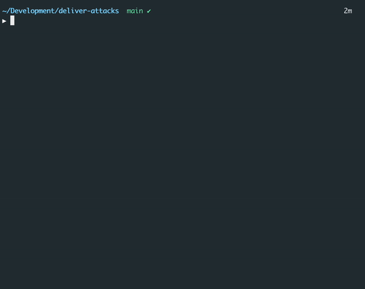

# Identify registered email addresses

A lot of valuable information has been leaked in the past by others. Attackers can easily get lists of email addresses - sometimes even with passwords - of accounts that were leaked elsewhere. Because our API returns errors messages that are too verbose and because there is no rate limiting on the `/auth/login` endpoint, attackers can easily match lists of email addresses with registered accounts. 

Here is a list of [1000 leaked email addresses](../../demos//attack-2/leaked.txt). With a bit of scripting - which I have done for you - you can easily try every email address and see what happens. 

```bash
deliver email-dict ./leaked.txt
```

The script sends the email address with password `password` to the API. Using the error message (`Wrong email address` or `Wrong password`) we can identify those email addresses that are registered with an account.

```
POST /auth/login
{
  "email": "hdegoe0@netvibes.com",
  "password": "password" 
}

401 Unauthorized
{
  "status": "401",
  "message": "Wrong email address"
}
```

When we run the script we see that we've been able to match six email addresses. 



# Note 

For convenience reasons I have included a script here that performs the attack for you. [Burp Suite](https://portswigger.net/burp) is a well-known application for penetration testing and provides similar featuers and much more. It has a steep learning curve, but if you are serious about penetration testing you'll want to dig into it.